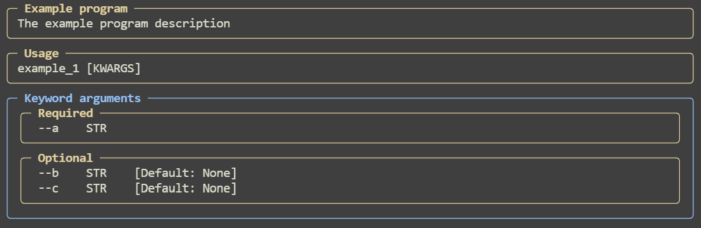
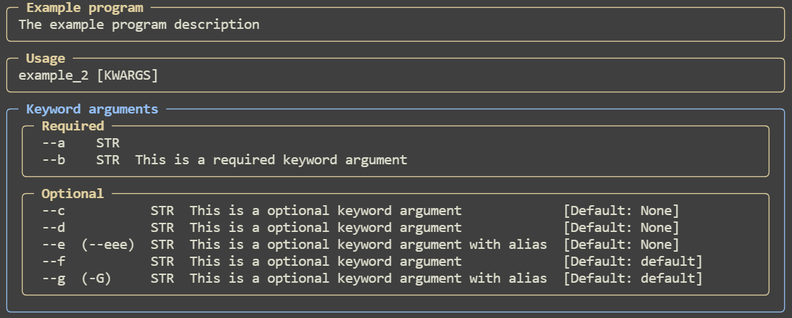
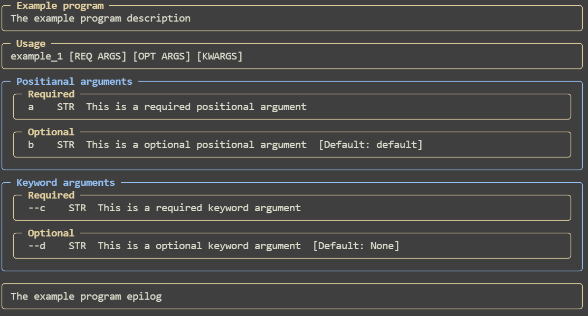

## Basic usage.

### Example 1:

```python
from pydantic import BaseModel
from typing import Optional
import pydantic_argparse_new as pa


class Temp(BaseModel):
    a: str  # This is required keyword argument
    b: str | None  # This is optional keyword argument
    c: Optional[str]  # This is optional keyword argument


cliargs = pa.parse(Temp, program_name="Example program", description="The example program description")

print(cliargs)
```

Input:

```bash
appname --a "example1" --b "example2"
```

Output:

```
a='example1' b='example2' c=None
```

Help:



### Example 2:

```python
from pydantic import BaseModel, Field
from typing import Optional
import pydantic_argparse_new as pa


class Temp(BaseModel):
    a: str = Field()  # This is a required keyword argument
    b: str = Field(..., description="This is a required keyword argument")
    c: str | None = Field(description="This is a optional keyword argument")
    d: Optional[str] = Field(description="This is a optional keyword argument")
    e: str = Field(None, description="This is a optional keyword argument with alias", alias="eee")
    f: str = Field("default", description="This is a optional keyword argument")
    g: str = Field("default", description="This is a optional keyword argument with alias", alias="-G")


cliargs = pa.parse(Temp, program_name="Example program", description="The example program description")

print(cliargs)
```

Input:

```bash
appname --a "example1" --b "example2" --eee "example3"
```

Output:

```
a='example1' b='example2' c=None d=None e='example3' f='default' g='default'
```

Help:



### Example 3:

```python
from pydantic import BaseModel
import pydantic_argparse_new as pa


class Temp(BaseModel):
    a: str = pa.Arg(..., description="This is a required positional argument")
    b: str = pa.Arg("default", description="This is a optional positional argument")

    # The pa.KwArg object is the same as just pydantic.Field.
    # Either one can always be used, it makes no difference.
    c: str = pa.KwArg(..., description="This is a required keyword argument")
    d: str = pa.KwArg(None, description="This is a optional keyword argument")


cliargs = pa.parse(
    Temp,
    program_name="Example program",
    description="The example program description",
    epilog="The example program epilog"
)

print(cliargs)
```

Input:

```bash
appname "test_a" "test_b" --c "test_c" --d "test_d"
```

Output:

```
a='test_a' b='test_b' c='test_c' d='test_d'
```

Help:

