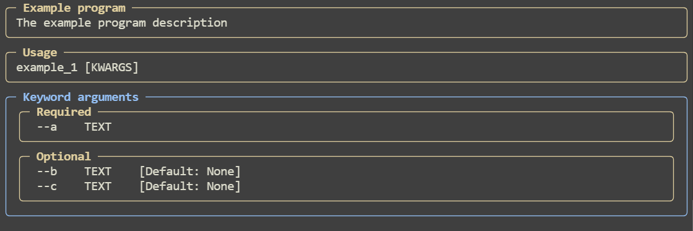
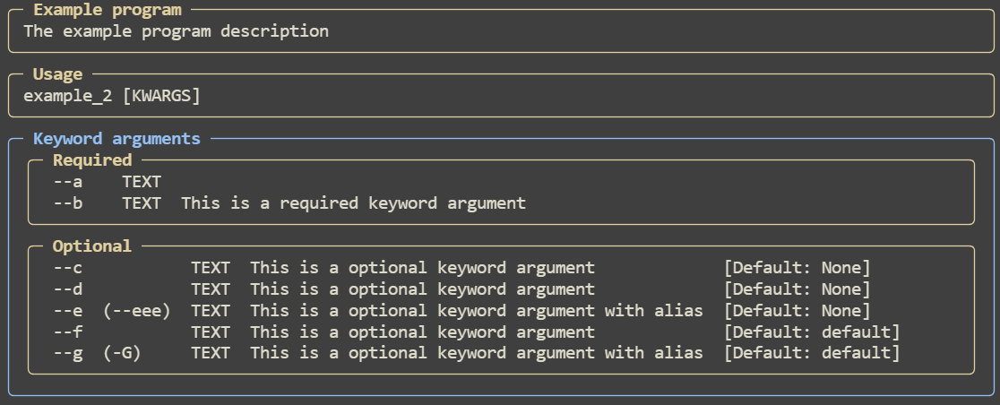

Basic usage.<br>
Pydantic only.


```python
from pydantic import BaseModel
from typing import Optional
from pydantic_argparse_new import parse


class Temp(BaseModel):
    a: str  # This is required keyword argument
    b: str | None  # This is optional keyword argument
    c: Optional[str]  # This is optional keyword argument


cliargs = parse(Temp, program_name="Example program", description="The example program description")

print(cliargs)
```

Input:
```bash
appname --a "example1" --b "example2"
```
Output:
```
a='example1' b='example2' c=None
```
Help:



```python
from pydantic import BaseModel, Field
from typing import Optional
from pydantic_argparse_new import parse


class Temp(BaseModel):
    a: str = Field()  # This is a required keyword argument
    b: str = Field(..., description="This is a required keyword argument")
    c: str | None = Field(description="This is a optional keyword argument")
    d: Optional[str] = Field(description="This is a optional keyword argument")
    e: str = Field(None, description="This is a optional keyword argument with alias", alias="eee")
    f: str = Field("default", description="This is a optional keyword argument")
    g: str = Field("default", description="This is a optional keyword argument with alias", alias="-G")


cliargs = parse(Temp, program_name="Example program", description="The example program description")

print(cliargs)
```

Input:
```bash
appname --a "example1" --b "example2" --eee "example3"
```
Output:
```
a='example1' b='example2' c=None d=None e='example3' f='default' g='default'
```
Help:

