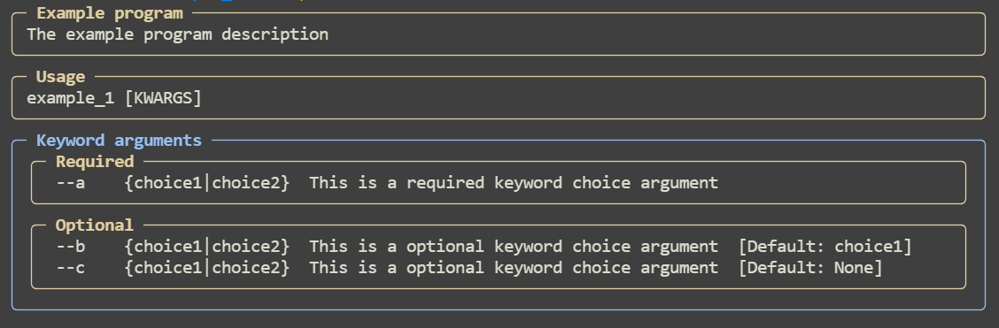
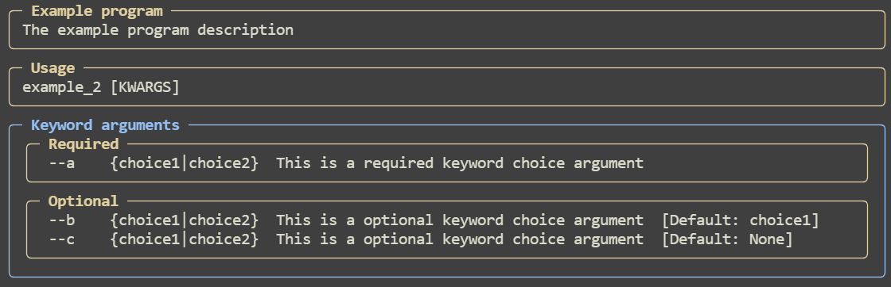

## Choice.

### Example 1:

```python
from pydantic import BaseModel
from typing import Literal
import pydantic_argparse_new as pa


class Temp(BaseModel):
    a: Literal["choice1", "choice2"] = pa.KwArg(..., description="This is a required keyword choice argument")
    b: Literal["choice1", "choice2"] = pa.KwArg("choice1", description="This is a optional keyword choice argument")
    c: Literal["choice1", "choice2"] = pa.KwArg(None, description="This is a optional keyword choice argument")


cliargs = pa.parse(Temp, program_name="Example program", description="The example program description")

print(cliargs)
```

Input:

```bash
appname --a "choice2"
```

Output:

```
a='choice2' b='choice1' c=None
```

Help:



### Example 2:

```python
from pydantic import BaseModel
from enum import Enum
import pydantic_argparse_new as pa


class Choices(Enum):
    choice1 = 1
    choice2 = 2


class Temp(BaseModel):
    a: Choices = pa.KwArg(..., description="This is a required keyword choice argument")
    b: Choices = pa.KwArg(Choices.choice1, description="This is a optional keyword choice argument")
    c: Choices = pa.KwArg(None, description="This is a optional keyword choice argument")


cliargs = pa.parse(Temp, program_name="Example program", description="The example program description")

print(cliargs)
```

Input:

```bash
appname --a "choice2"
```

Output:

```
a=<Choices.choice2: 2> b=<Choices.choice1: 1> c=None
```

Help:


