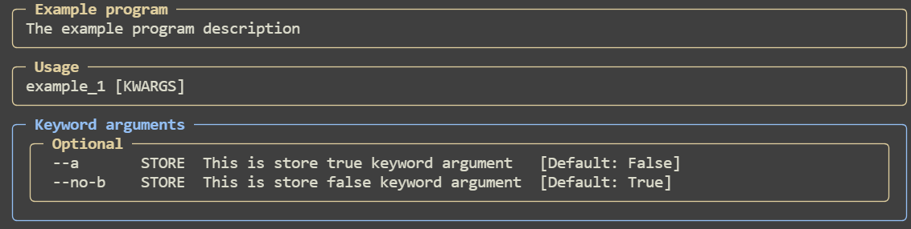

## Store True \ False

### Example 1:

```python
from pydantic import BaseModel
import pydantic_argparse_new as pa


class Temp(BaseModel):
    # Store True\False arguments can't be positional
    a: bool = pa.KwArg(False, description="This is store true keyword argument")
    b: bool = pa.KwArg(True, description="This is store false keyword argument")


cliargs = pa.parse(Temp)

print(cliargs)
```

Input:

```bash
appname --a --no-b
```

Output:

```
a=True b=False
```

Help:


