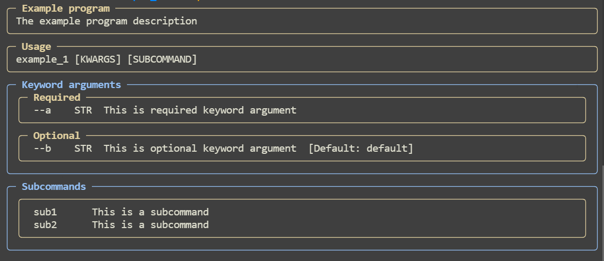
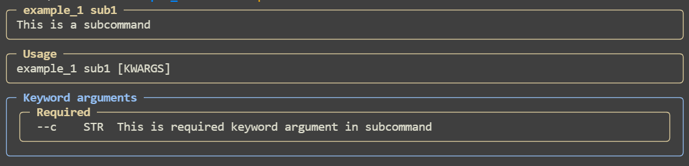
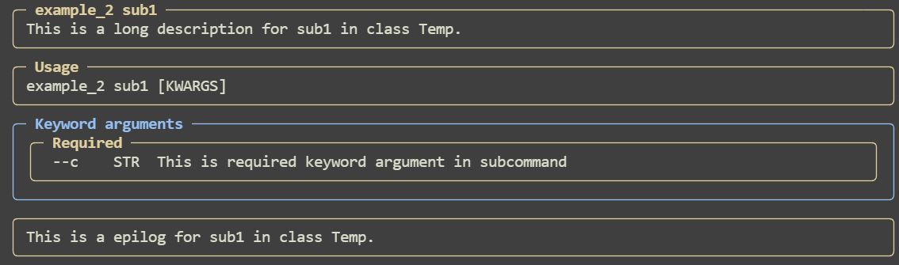

## Subcommands

### Example 1:

```python
from pydantic import BaseModel
import pydantic_argparse_new as pa


class Subcommand1(BaseModel):
    c: str = pa.KwArg(..., description="This is required keyword argument in subcommand")


class Subcommand2(BaseModel):
    d: str = pa.KwArg(..., description="This is required keyword argument in subcommand")


class Temp(BaseModel):
    a: str = pa.KwArg(..., description="This is required keyword argument")
    b: str = pa.KwArg("default", description="This is optional keyword argument")

    # Subcommands must be made optional in any way
    # Regardless, at least one subcommand must be selected in the CLI unless otherwise configured.
    sub1: Subcommand1 = pa.Subcommand(None, description="This is a subcommand")
    sub2: Subcommand2 = pa.Subcommand(None, description="This is a subcommand")


cliargs = pa.parse(Temp, program_name="Example program", description="The example program description")

# The selected subcommand is always available in the __subcommand__ attribute.
subcommand_name = cliargs.__subcommand__.name
subcommand_value = cliargs.__subcommand__.value

print(cliargs)
print(f"Subcommand name: {subcommand_name}")
print(f"Subcommand value: {subcommand_value}")
```

Input:

```bash
appname --a "example" sub1 --c "example2"
```

Output:

```
a='example' b='default' sub1=Subcommand1(c='example2') sub2=None
Subcommand name: sub1
Subcommand value: c='example2'
```

Help:



Help (in subcommand):

```bash
appname sub1 --help
```



#### Setting help for subcommands:

```python
class Temp(BaseModel):
    a: str = pa.KwArg(..., description="This is required keyword argument")
    b: str = pa.KwArg("default", description="This is optional keyword argument")

    # Subcommands must be made optional in any way
    # Regardless, at least one subcommand must be selected in the CLI unless otherwise configured.
    sub1: Subcommand1 = pa.Subcommand(
        None,
        description="This is a subcommand",
        long_description="This is a long description for sub1 in class Temp.",
        epilog="This is a epilog for sub1 in class Temp."
    )
    sub2: Subcommand2 = pa.Subcommand(
        None,
        description="This is a subcommand",
        long_description="This is a long description for sub2 in class Temp.",
        epilog="This is a epilog for sub2 in class Temp."
    )
```

```bash
appname sub1 --help
```



### Optional subcommands:

```python
cliargs = pa.parse(
    Temp,
    program_name="Example program",
    description="The example program description",
    subcomand_required=False
)
```

Input:

```bash
appname --a "example1"
```

Output:

```
a='example1' b='default' sub1=None sub2=None
```


